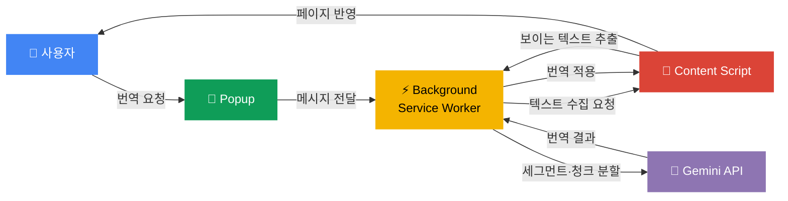

**언어:** [English](./README.md) | [한국어](./README.ko.md)

<div align="center">

# 🌐 Context Translator

**Gemini 3.1 Flash-Lite Preview로 웹페이지를 빠르게 번역하는 Chrome 확장 프로그램**

기능이 많은 번역기보다, **팝업 열기 → 설정 확인 → 번역**이라는\
짧고 분명한 흐름에 집중합니다.

[](https://developer.chrome.com/docs/extensions)
[](https://developer.chrome.com/docs/extensions/develop/migrate)
[](https://ai.google.dev/gemini-api/docs/models/gemini-3.1-flash-lite-preview?hl=ko)
[](#)
[](./LICENSE)

</div>

---

> [!NOTE]
> 이 확장 프로그램은 **사용자 본인의 Gemini API 키**가 필요합니다. 키는 [Google AI Studio](https://aistudio.google.com/app/apikey)에서 발급할 수 있습니다.\
> `http://` / `https://` 페이지에서 동작하며, `chrome://` 등 브라우저 내부 페이지에서는 동작하지 않습니다.

---

## ✨ 주요 기능

| 기능                  | 설명                                              |
| :-------------------- | :------------------------------------------------ |
| 🔄 **페이지 번역**    | 현재 탭의 웹페이지를 선택한 언어로 즉시 번역      |
| 🔍 **원문 자동 감지** | 원문 언어를 `자동`으로 감지하여 번역              |
| ↔️ **언어 방향 전환** | 원문 ↔ 번역 언어를 한 번에 바꾸기                 |
| 🤖 **자동 번역**      | 특정 언어·특정 사이트를 항상 자동 번역하도록 설정 |
| 👀 **원문 함께 보기** | 번역문 hover 시 원문을 바로 확인                  |
| 📊 **진행 상태 표시** | 번역 진행률을 실시간으로 표시                     |
| 🌐 **한/영 UI 지원**  | Chrome UI 언어에 맞춰 팝업을 한국어/영어로 표시   |
| 🔑 **API 키 관리**    | 키 저장, 초기화, 연결 상태 확인까지 팝업에서 완결 |

---

## 🚀 Quick Start

빌드 과정 없이 Chrome에 바로 불러오면 됩니다.

```
1. chrome://extensions 를 엽니다
2. 오른쪽 위 「개발자 모드」를 켭니다
3. 「압축해제된 확장 프로그램을 로드합니다」를 클릭합니다
4. 이 프로젝트 폴더를 선택합니다
5. 팝업에서 Gemini API 키를 입력하고 「저장」합니다
6. 「확인」 버튼으로 API 연결 상태를 점검합니다
7. 번역할 페이지에서 언어를 고른 뒤 「번역」을 누릅니다
```

> [!TIP]
> 코드를 수정한 뒤에는 `chrome://extensions`에서 확장 프로그램을 **새로고침**하면 즉시 반영됩니다.

---

## 🌍 지원 언어

<table>
<tr>
<td>

| 언어             | 원문 | 번역 |
| :--------------- | :--: | :--: |
| 🇰🇷 한국어        |  ✅  |  ✅  |
| 🇺🇸 영어          |  ✅  |  ✅  |
| 🇯🇵 일본어        |  ✅  |  ✅  |
| 🇨🇳 중국어 (간체) |  ✅  |  ✅  |
| 🇹🇼 중국어 (번체) |  ✅  |  ✅  |

</td>
<td>

| 언어         | 원문 | 번역 |
| :----------- | :--: | :--: |
| 🇪🇸 스페인어  |  ✅  |  ✅  |
| 🇫🇷 프랑스어  |  ✅  |  ✅  |
| 🇩🇪 독일어    |  ✅  |  ✅  |
| 🇻🇳 베트남어  |  ✅  |  ✅  |
| 🔍 자동 감지 |  ✅  |  —   |

</td>
</tr>
</table>

---

## ⚙️ 작동 원리



<details>
<summary><b>📝 단계별 상세 설명</b></summary>

1. **Popup** — 현재 탭 정보와 저장된 설정을 읽어 UI를 초기화합니다.
2. **Popup → Background** — 사용자가 번역을 시작하면 background service worker에 요청합니다.
3. **Background → Content Script** — 현재 페이지의 텍스트 수집을 요청합니다.
4. **Content Script** — 보이는 텍스트만 추출하고, 번역에서 제외할 문자열(URL, 코드 등)을 걸러냅니다.
5. **Background → Gemini API** — 텍스트를 세그먼트·청크 단위로 나눠 Gemini API에 번역을 요청합니다.
6. **Content Script** — 번역 결과를 받아 페이지에 반영합니다.

</details>

---

## 🛡️ 자동 번역 규칙

자동 번역은 아래 **둘 중 하나**에 해당하면 동작합니다:

- ✅ 현재 페이지 언어가 **항상 번역** 목록에 있을 때
- ✅ 현재 사이트가 **항상 번역** 목록에 있을 때

> [!WARNING]
> 민감할 수 있는 페이지에서는 자동 번역이 **의도적으로 비활성화**됩니다.
>
> - 메일 서비스 일부
> - 메신저 / 협업 도구 일부
> - Google Docs, Drive, Calendar 일부
> - 비밀번호 입력창이 있는 페이지

---

## 🎯 번역 품질 철학

> **"아주 똑똑한 번역"보다 "빠르고 안정적으로 읽히는 번역"**

모델에게 더 많은 판단을 맡기는 대신, **입력을 더 안전하게 정리하는** 방향을 택하고 있습니다.\
이 부분은 휴리스틱 기반의 `best-effort` 접근이며, 모든 페이지에서 완벽함을 보장하지는 않습니다.

| 전략           | 설명                                                               |
| :------------- | :----------------------------------------------------------------- |
| 🚫 제외 패턴   | URL, 이메일, 파일 경로, 코드, 식별자 패턴은 번역 전에 우선 제외    |
| ✂️ 스마트 분할 | 문단·리스트·문장 경계·줄바꿈을 우선해 텍스트를 분할                |
| 🔗 조각 병합   | 너무 짧게 쪼개진 조각은 다시 합쳐 문맥 손실을 방지                 |
| 🏷️ 타입 힌트   | 버튼·제목·라벨·리스트·링크·본문 등의 가벼운 힌트를 프롬프트에 전달 |

---

## 💾 저장소 구조

설정은 `chrome.storage.local`에 저장됩니다.

```
├── API 키
├── 원문 언어 / 번역 언어
├── 「원문 함께 보기」 설정
├── 자동 번역할 언어 목록
├── 자동 번역할 사이트 목록
└── 최근 API 서버 확인 결과
```

> [!IMPORTANT]
> 현재는 개인용 프로토타입 기준이라 API 키를 **로컬 저장**하는 구조입니다.\
> 공개 배포를 고려한다면, 서버 프록시 구조를 검토하는 편이 더 안전합니다.

---

## 📁 프로젝트 구조

```
context-translator/
├── 📄 manifest.json           # 확장 프로그램 설정
├── 📄 popup.html              # 팝업 마크업
├── 📄 README.md               # 영어 README
├── 📄 README.ko.md            # 한국어 README
├── 📂 _locales/               # Chrome i18n 메시지
│   ├── 📂 en/
│   └── 📂 ko/
├── 📂 docs/                   # 문서
└── 📂 src/
    ├── 📂 background/
    │   └── background.js      # 번역 요청, 상태 관리, API 통신
    ├── 📂 content/
    │   ├── content.css        # 번역 결과 표시 스타일
    │   └── content.js         # 페이지 텍스트 수집·번역 결과 적용
    ├── 📂 popup/
    │   ├── popup.css          # 팝업 스타일
    │   └── popup.js           # 팝업 상태, 저장, 버튼 동작
    └── 📂 shared/
        └── i18n.js            # 공통 언어/locale 헬퍼
```

---

## ⚠️ 제한 사항

| 항목          | 설명                                                    |
| :------------ | :------------------------------------------------------ |
| 프로토콜 제한 | `http://` / `https://` 페이지에서만 동작                |
| 브라우저 내부 | `chrome://` 등 내부 페이지 미지원                       |
| 동적 사이트   | 구조가 계속 바뀌는 페이지에서 일부 적용 실패 가능       |
| API 키 보안   | 사용자 기기 로컬 저장 기준 (공개 배포용 보안 구조 아님) |
| 재시도 보정   | 선택적 재시도 기반 품질 보정 미구현                     |

---

## 🛠️ 기술 스택

| 분류        | 기술                                         |
| :---------- | :------------------------------------------- |
| 플랫폼      | Chrome Extension Manifest V3                 |
| UI          | Popup HTML/CSS/JS                            |
| 페이지 연동 | Content Script                               |
| 백그라운드  | Background Service Worker                    |
| 저장소      | `chrome.storage.local`                       |
| 번역 엔진   | Gemini API (`gemini-3.1-flash-lite-preview`) |

---

## 📚 참고 자료

| 자료                          | 링크                                                                                          |
| :---------------------------- | :-------------------------------------------------------------------------------------------- |
| Gemini 3.1 Flash-Lite Preview | [공식 문서](https://ai.google.dev/gemini-api/docs/models/gemini-3.1-flash-lite-preview?hl=ko) |
| Chrome Extensions Manifest V3 | [마이그레이션 가이드](https://developer.chrome.com/docs/extensions/develop/migrate)           |

---

## 📄 License

이 프로젝트는 [MIT License](./LICENSE)를 따릅니다.

---
