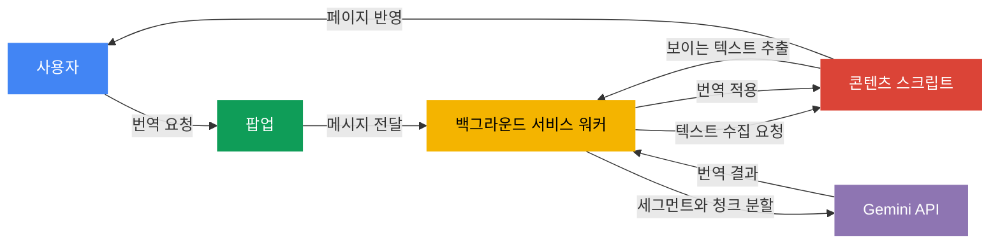

**언어:** [English](./README.md) | 한국어

<div align="center">

# Context Translator

`gemini-3.1-flash-lite-preview`로 현재 웹페이지를 번역하는 Chrome 확장 프로그램입니다.

**팝업 열기 -> 설정 확인 -> 번역**

[](https://developer.chrome.com/docs/extensions)
[](https://developer.chrome.com/docs/extensions/develop/migrate)
[](https://ai.google.dev/gemini-api/docs/models/gemini-3.1-flash-lite-preview?hl=ko)
[](#)
[](./LICENSE)

</div>

> [!NOTE]
> 이 확장 프로그램을 쓰려면 본인의 Gemini API 키가 필요합니다. 키는 [Google AI Studio](https://aistudio.google.com/app/apikey)에서 만들 수 있습니다.
> `http://`와 `https://` 페이지에서만 동작하며, `chrome://` 같은 브라우저 내부 페이지에서는 실행되지 않습니다.

## ✨ 개요

Context Translator는 입문자도 바로 써볼 수 있도록 흐름을 단순하게 잡은 번역 확장 프로그램입니다.
기능을 많이 넣기보다 아래 흐름에 집중합니다.

`팝업 열기 -> 설정 확인 -> 번역`

## 🔍 주요 기능

| 기능 | 설명 |
| :--- | :--- |
| 페이지 번역 | 현재 탭을 선택한 언어로 번역 |
| 원문 자동 감지 | 원문 언어를 `자동`으로 감지 |
| 언어 방향 전환 | 원문 언어와 번역 언어를 한 번에 바꾸기 |
| 자동 번역 | 특정 언어 또는 사이트를 항상 자동 번역 |
| 원문 보기 | 번역문에 마우스를 올리면 원문 보기 |
| 진행 상태 표시 | 번역 진행 상황을 실시간으로 표시 |
| 한영 UI 지원 | Chrome UI 언어에 따라 팝업 언어 전환 |
| API 키 관리 | 팝업에서 API 키 저장, 삭제, 연결 확인 |

## 🚀 빠른 시작

빌드 없이 Chrome에 바로 불러와서 실행할 수 있습니다.

```text
1. chrome://extensions 를 엽니다
2. "개발자 모드"를 켭니다
3. "압축해제된 확장 프로그램을 로드합니다"를 클릭합니다
4. 이 프로젝트 폴더를 선택합니다
5. 팝업에서 Gemini API 키를 입력하고 "저장"을 클릭합니다
6. "확인" 버튼으로 API 연결 상태를 점검합니다
7. 번역할 페이지에서 언어를 고른 뒤 "번역"을 클릭합니다
```

> [!TIP]
> 코드를 수정한 뒤에는 `chrome://extensions`에서 **새로고침**을 누르면 바로 반영됩니다.

## 🌍 지원 언어

| 언어 | 원문 | 번역 |
| :--- | :--: | :--: |
| 한국어 | ✅ | ✅ |
| 영어 | ✅ | ✅ |
| 일본어 | ✅ | ✅ |
| 중국어 간체 | ✅ | ✅ |
| 중국어 번체 | ✅ | ✅ |
| 스페인어 | ✅ | ✅ |
| 프랑스어 | ✅ | ✅ |
| 독일어 | ✅ | ✅ |
| 베트남어 | ✅ | ✅ |
| 자동 감지 | ✅ | - |

## ⚙️ 동작 방식



### 단계별 흐름

1. 팝업이 현재 탭과 저장된 설정을 읽습니다.
2. 백그라운드 서비스 워커가 번역 실행을 시작합니다.
3. 콘텐츠 스크립트가 페이지에서 보이는 텍스트를 수집합니다.
4. 백그라운드가 텍스트를 세그먼트와 청크로 나눕니다.
5. Gemini가 각 청크에 대한 번역 JSON을 반환합니다.
6. 콘텐츠 스크립트가 번역 결과를 페이지에 다시 적용합니다.

## 🛡️ 자동 번역 규칙

자동 번역은 아래 둘 중 하나에 해당하면 실행됩니다.

- 현재 페이지 언어가 항상 번역할 언어 목록에 있을 때
- 현재 사이트가 항상 번역할 사이트 목록에 있을 때

> [!WARNING]
> 자동 번역은 민감한 정보가 있을 수 있는 페이지에서 의도적으로 꺼집니다.
>
> - 일부 메일 서비스
> - 일부 메신저와 협업 도구
> - Google Docs, Drive, Calendar 일부 페이지
> - 비밀번호 입력창이 있는 페이지

## 🎯 번역 품질 방향

> 아주 똑똑한 번역보다 빠르고 읽기 쉬운 번역을 우선합니다.

모델이 모든 걸 추론하게 하기보다, 입력을 더 안전하고 읽기 쉽게 정리한 뒤 번역하도록 구성했습니다.
이 방식은 휴리스틱 기반의 `best-effort` 접근이라 모든 페이지에서 완벽함을 보장하지는 않습니다.

| 전략 | 설명 |
| :--- | :--- |
| 제외 규칙 | URL, 이메일, 파일 경로, 코드, 식별자처럼 보이는 문자열은 먼저 제외 |
| 스마트 분할 | 문단, 리스트, 문장, 줄바꿈 경계를 우선해서 분할 |
| 짧은 조각 병합 | 너무 짧은 조각은 다시 합쳐 문맥 손실 줄이기 |
| 타입 힌트 | 버튼, 제목, 라벨, 링크, 본문 같은 가벼운 힌트 전달 |

## 🔐 저장 방식과 보안 메모

설정은 `chrome.storage.local`에 저장됩니다.

```text
- API 키
- 원문 언어 / 번역 언어
- "원문 함께 보기" 설정
- 자동 번역할 언어 목록
- 자동 번역할 사이트 목록
- 최근 API 상태 확인 결과
```

> [!IMPORTANT]
> 현재 이 프로젝트는 개인용 프로토타입입니다.
> Gemini API 키는 사용자 기기에 로컬 저장됩니다.
> 공개 배포를 고려한다면 서버 프록시 구조를 검토하는 편이 더 안전합니다.

## 📁 프로젝트 구조

```text
context-translator/
├── manifest.json
├── popup.html
├── README.md
├── README.ko.md
├── _locales/
│   ├── en/messages.json
│   └── ko/messages.json
├── docs/
├── scripts/
│   └── validate-locales.mjs
└── src/
    ├── background/background.js
    ├── content/content.css
    ├── content/content.js
    ├── popup/popup.css
    ├── popup/popup.js
    └── shared/i18n.js
```

## ✅ 검증 방법

로직, 팝업 마크업, 로케일 파일, README 파일을 바꾼 뒤에는 아래 명령으로 기본 검증을 진행합니다.

```text
node --check src/background/background.js
node --check src/content/content.js
node --check src/popup/popup.js
node scripts/validate-locales.mjs
```

## ⚠️ 제한 사항

| 항목 | 설명 |
| :--- | :--- |
| 프로토콜 제한 | `http://`와 `https://` 페이지에서만 동작 |
| 내부 페이지 | `chrome://` 같은 브라우저 내부 페이지는 지원하지 않음 |
| 동적 사이트 | 번역 도중 페이지 구조가 바뀌면 일부 적용이 실패할 수 있음 |
| API 키 보안 | 사용자 기기에 로컬 저장되며 공개 배포용 보안 구조는 아님 |
| 재시도 보정 | 선택적 재시도 기반 품질 보정은 아직 없음 |

## 🛠️ 기술 스택

| 분류 | 기술 |
| :--- | :--- |
| 플랫폼 | Chrome Extension Manifest V3 |
| UI | Popup HTML, CSS, JavaScript |
| 페이지 연동 | Content Script |
| 백그라운드 | Background Service Worker |
| 저장소 | `chrome.storage.local` |
| 번역 엔진 | Gemini API (`gemini-3.1-flash-lite-preview`) |

## 📚 참고 자료

| 자료 | 링크 |
| :--- | :--- |
| Gemini 3.1 Flash-Lite Preview | [공식 문서](https://ai.google.dev/gemini-api/docs/models/gemini-3.1-flash-lite-preview?hl=ko) |
| Chrome Extensions Manifest V3 | [마이그레이션 가이드](https://developer.chrome.com/docs/extensions/develop/migrate) |

## 📄 라이선스

이 프로젝트는 [MIT License](./LICENSE)를 따릅니다.
