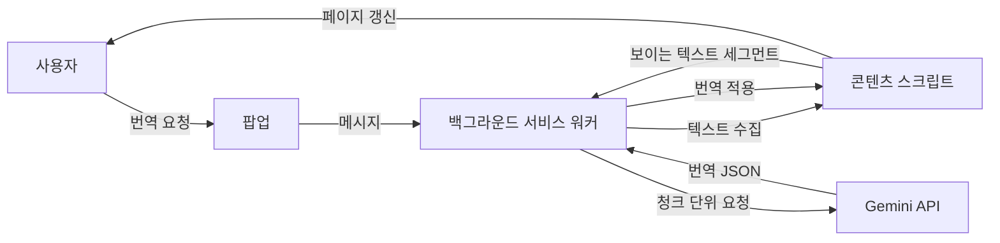

**언어:** [English](./README.md) | 한국어

# Context Translator

Context Translator는 `gemini-3.1-flash-lite-preview`를 사용해 현재 페이지를 번역하는 Chrome 확장 프로그램입니다.

프로젝트 목표는 흐름을 단순하게 유지하는 것입니다.

`팝업 열기 -> 설정 확인 -> 번역`

## 빠른 시작

```text
1. chrome://extensions 를 엽니다.
2. "개발자 모드"를 켭니다.
3. "압축해제된 확장 프로그램을 로드합니다"를 클릭합니다.
4. 이 프로젝트 폴더를 선택합니다.
5. 팝업에서 Gemini API 키를 입력하고 "저장"을 클릭합니다.
6. "확인"으로 API 연결 상태를 점검합니다.
7. 번역할 페이지에서 언어를 고른 뒤 "번역"을 클릭합니다.
```

확장은 `http://` 와 `https://` 페이지에서만 동작합니다.

## 주요 기능

- 현재 탭을 선택한 언어로 번역
- `자동`으로 원문 언어 자동 감지
- 한 번에 원문 언어와 목표 언어 교체
- 특정 언어 또는 사이트 자동 번역
- 마우스를 올리면 원문 보기
- 번역 진행 상태 실시간 표시
- Chrome UI 언어에 따라 영어/한국어 팝업 텍스트 표시
- 팝업에서 Gemini API 키 저장, 삭제, 연결 확인

## 동작 방식



### 실행 흐름

1. 팝업이 현재 탭과 저장된 설정을 불러옵니다.
2. 백그라운드 서비스 워커가 번역 실행을 시작하고 진행 상태를 추적합니다.
3. 콘텐츠 스크립트가 페이지에서 보이는 텍스트를 수집합니다.
4. 백그라운드가 텍스트를 청크로 나눠 Gemini에 요청합니다.
5. 콘텐츠 스크립트가 번역 결과를 페이지에 다시 적용합니다.

## 자동 번역 안전 장치

자동 번역은 민감한 정보가 있을 수 있는 페이지에서 의도적으로 막아 둡니다. 예를 들면:

- 메일 서비스
- 협업 도구와 메신저
- 일부 Google Docs, Drive, Calendar 페이지
- 비밀번호 입력창이 있는 페이지

## 프로젝트 구조

```text
context-translator/
├─ manifest.json
├─ popup.html
├─ README.md
├─ README.ko.md
├─ _locales/
│  ├─ en/messages.json
│  └─ ko/messages.json
├─ docs/
└─ src/
   ├─ background/background.js
   ├─ content/content.css
   ├─ content/content.js
   ├─ popup/popup.css
   ├─ popup/popup.js
   └─ shared/i18n.js
```

## 검증 방법

로직, 팝업 마크업, 로케일/문서 파일을 바꾼 뒤에는 아래 명령으로 기본 검증을 수행합니다.

```text
node --check src/background/background.js
node --check src/content/content.js
node --check src/popup/popup.js
node scripts/validate-locales.mjs
```

## 제한 사항

- 확장은 `http://` 와 `https://` 페이지에서만 동작합니다.
- 동적인 페이지는 번역 중 구조가 바뀔 수 있습니다.
- Gemini API 키는 `chrome.storage.local`에 로컬 저장됩니다.
- 번역 품질은 페이지 구조와 문맥에 따라 달라질 수 있습니다.

## 라이선스

이 프로젝트는 [MIT License](./LICENSE)를 따릅니다.
