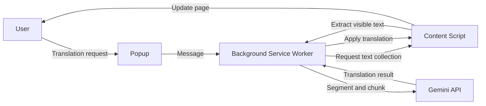

**Language:** English | [Korean](./README.ko.md)

<div align="center">

# Context Translator

Translate the current webpage with `gemini-3.1-flash-lite-preview` in a simple Chrome extension flow.

**Open popup -> confirm settings -> translate**

[](https://developer.chrome.com/docs/extensions)
[](https://developer.chrome.com/docs/extensions/develop/migrate)
[](https://ai.google.dev/gemini-api/docs/models/gemini-3.1-flash-lite-preview?hl=en)
[](#)
[](./LICENSE)

</div>

> [!NOTE]
> This extension requires your own Gemini API key from [Google AI Studio](https://aistudio.google.com/app/apikey).
> It works on `http://` and `https://` pages, and does not run on internal browser pages such as `chrome://`.

## Overview

Context Translator is a beginner-friendly Chrome extension prototype for translating the current page.
Instead of trying to do everything, it focuses on a short and readable flow:

`open popup -> confirm settings -> translate`

## Features

| Feature | Description |
| :------ | :---------- |
| Page translation | Translate the current tab into the selected language |
| Auto source detect | Detect the source language automatically with `Auto` |
| Swap direction | Swap source and target languages in one click |
| Auto translate | Always translate selected languages or specific sites |
| Show original | See the original text by hovering translated content |
| Progress status | Show real-time progress while translation is running |
| Korean and English UI | Follow Chrome UI language in the popup |
| API key management | Save, clear, and verify the Gemini API key in the popup |

## Quick Start

You can load the extension directly into Chrome without a build step.

```text
1. Open chrome://extensions
2. Turn on "Developer mode"
3. Click "Load unpacked"
4. Select this project folder
5. Enter your Gemini API key in the popup and click "Save"
6. Click "Check" to verify the API connection
7. Open a page, choose languages, and click "Translate"
```

> [!TIP]
> After changing code, click **Reload** on `chrome://extensions` to apply the update immediately.

## Supported Languages

| Language | Source | Target |
| :------- | :----: | :----: |
| Korean |  ✅  |  ✅  |
| English |  ✅  |  ✅  |
| Japanese |  ✅  |  ✅  |
| Chinese (Simplified) |  ✅  |  ✅  |
| Chinese (Traditional) |  ✅  |  ✅  |
| Spanish |  ✅  |  ✅  |
| French |  ✅  |  ✅  |
| German |  ✅  |  ✅  |
| Vietnamese |  ✅  |  ✅  |
| Auto detect |  ✅  |  -  |

## How It Works



### Step by Step

1. The popup reads the current tab and saved settings.
2. The background service worker starts the translation run.
3. The content script collects visible text from the page.
4. The background script splits text into segments and chunks.
5. Gemini returns translated JSON for each chunk.
6. The content script applies the translated text back to the page.

## Auto-Translate Rules

Auto-translate runs when either of these is true:

- The current page language is in the always-translate language list
- The current site is in the always-translate site list

> [!WARNING]
> Auto-translate is intentionally disabled on pages that may contain sensitive content.
>
> - Some mail services
> - Some messaging and collaboration tools
> - Parts of Google Docs, Drive, and Calendar
> - Pages with password input fields

## Translation Quality Philosophy

> Fast and reliably readable translation is more important than overly clever translation.

This project tries to make the input safer and cleaner before asking the model to translate it.
It is a heuristic, best-effort approach, so perfect results are not guaranteed on every page.

| Strategy | Description |
| :------- | :---------- |
| Exclusion rules | Exclude URLs, emails, file paths, code, and identifier-like strings first |
| Smart splitting | Prefer paragraph, list, sentence, and line-break boundaries |
| Merge short parts | Re-merge very short pieces to reduce context loss |
| Type hints | Pass light webpage hints such as button, heading, label, link, or paragraph |

## Storage and Security Notes

Settings are stored in `chrome.storage.local`.

```text
- API key
- Source language / target language
- "Show original on hover" setting
- Languages to auto-translate
- Sites to auto-translate
- Latest API status check result
```

> [!IMPORTANT]
> This repository is currently a personal prototype.
> The Gemini API key is stored locally on the user's machine.
> If you plan to distribute it publicly, a server proxy architecture would be safer.

## Project Structure

```text
context-translator/
|- manifest.json
|- popup.html
|- README.md
|- README.ko.md
|- _locales/
|  |- en/messages.json
|  `- ko/messages.json
|- docs/
|- scripts/
|  `- validate-locales.mjs
`- src/
   |- background/background.js
   |- content/content.css
   |- content/content.js
   |- popup/popup.css
   |- popup/popup.js
   `- shared/i18n.js
```

## Validation

Run these checks after changing logic, popup markup, locale files, or README files:

```text
node --check src/background/background.js
node --check src/content/content.js
node --check src/popup/popup.js
node scripts/validate-locales.mjs
```

## Limitations

| Item | Description |
| :--- | :---------- |
| Protocol limit | Works only on `http://` and `https://` pages |
| Internal pages | `chrome://` and other internal browser pages are not supported |
| Dynamic sites | Some content may fail when page structure changes during translation |
| API key security | Stored locally on the device, not designed for public-release security |
| Retry refinement | Optional retry-based quality refinement is not implemented |

## Tech Stack

| Category | Technology |
| :------- | :--------- |
| Platform | Chrome Extension Manifest V3 |
| UI | Popup HTML, CSS, and JavaScript |
| Page bridge | Content Script |
| Background | Background Service Worker |
| Storage | `chrome.storage.local` |
| Translation | Gemini API (`gemini-3.1-flash-lite-preview`) |

## References

| Resource | Link |
| :------- | :--- |
| Gemini 3.1 Flash-Lite Preview | [Official docs](https://ai.google.dev/gemini-api/docs/models/gemini-3.1-flash-lite-preview?hl=en) |
| Chrome Extensions Manifest V3 | [Migration guide](https://developer.chrome.com/docs/extensions/develop/migrate) |

## License

This project is licensed under the [MIT License](./LICENSE).
