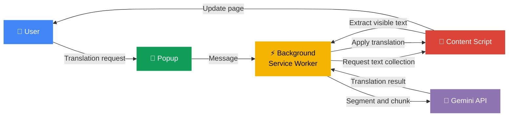

**Language:** [English](./README.md) | [한국어](./README.ko.md)

<div align="center">

# 🌐 Context Translator

**A Chrome extension that quickly translates webpages with Gemini 3.1 Flash-Lite Preview**

Instead of packing in too many features, it focuses on a short, clear flow:
**open popup → confirm settings → translate**.

[](https://developer.chrome.com/docs/extensions)
[](https://developer.chrome.com/docs/extensions/develop/migrate)
[](https://ai.google.dev/gemini-api/docs/models/gemini-3.1-flash-lite-preview?hl=en)
[](#)
[](./LICENSE)

</div>

---

> [!NOTE]
> This extension requires **your own Gemini API key**. You can create one in [Google AI Studio](https://aistudio.google.com/app/apikey).\
> It works on `http://` / `https://` pages and does not run on internal browser pages such as `chrome://`.

---

## ✨ Features

| Feature                 | Description                                                          |
| :---------------------- | :------------------------------------------------------------------- |
| 🔄 **Page Translation** | Instantly translate the current tab into the selected language       |
| 🔍 **Auto Source Detect** | Detect the source language automatically with `Auto`               |
| ↔️ **Swap Direction**   | Swap source ↔ target languages in one click                          |
| 🤖 **Auto Translate**   | Always translate selected languages or specific sites automatically  |
| 👀 **Show Original**    | Check the original text by hovering translated content               |
| 📊 **Progress Status**  | Show real-time progress while translation is running                 |
| 🌐 **Korean/English UI** | The popup follows Chrome's UI language and switches between Korean and English |
| 🔑 **API Key Management** | Save, clear, and check the API connection from the popup          |

---

## 🚀 Quick Start

You can load it directly into Chrome without a build step.

```text
1. Open chrome://extensions
2. Turn on "Developer mode" in the top-right corner
3. Click "Load unpacked"
4. Select this project folder
5. Enter your Gemini API key in the popup and click "Save"
6. Use "Check" to verify the API connection
7. Open a page to translate, choose languages, and click "Translate"
```

> [!TIP]
> After changing code, use **Reload** on `chrome://extensions` to apply updates immediately.

---

## 🌍 Supported Languages

<table>
<tr>
<td>

| Language                | Source | Target |
| :---------------------- | :----: | :----: |
| 🇰🇷 Korean               |   ✅   |   ✅   |
| 🇺🇸 English              |   ✅   |   ✅   |
| 🇯🇵 Japanese             |   ✅   |   ✅   |
| 🇨🇳 Chinese (Simplified) |   ✅   |   ✅   |
| 🇹🇼 Chinese (Traditional) |  ✅   |   ✅   |

</td>
<td>

| Language        | Source | Target |
| :-------------- | :----: | :----: |
| 🇪🇸 Spanish      |   ✅   |   ✅   |
| 🇫🇷 French       |   ✅   |   ✅   |
| 🇩🇪 German       |   ✅   |   ✅   |
| 🇻🇳 Vietnamese   |   ✅   |   ✅   |
| 🔍 Auto Detect   |   ✅   |   —    |

</td>
</tr>
</table>

---

## ⚙️ How It Works



<details>
<summary><b>📝 Step-by-step details</b></summary>

1. **Popup** reads the current tab and saved settings to initialize the UI.
2. **Popup → Background** sends a request when the user starts translation.
3. **Background → Content Script** asks for translatable text from the current page.
4. **Content Script** extracts only visible text and filters strings that should stay untouched, such as URLs or code.
5. **Background → Gemini API** sends segmented chunks to Gemini for translation.
6. **Content Script** receives the translated result and applies it to the page.

</details>

---

## 🛡️ Auto-Translate Rules

Auto-translate runs when **either one** of these is true:

- ✅ The current page language is in the **always translate** language list
- ✅ The current site is in the **always translate** site list

> [!WARNING]
> Auto-translate is **intentionally disabled** on potentially sensitive pages.
>
> - Some mail services
> - Some messengers and collaboration tools
> - Parts of Google Docs, Drive, and Calendar
> - Pages with password input fields

---

## 🎯 Translation Quality Philosophy

> **"Fast and reliably readable translation" over "extremely clever translation"**

Instead of asking the model to infer too much, this project leans toward
**making the input safer and cleaner first**.\
This is a heuristic `best-effort` approach, so it does not guarantee perfect results on every page.

| Strategy            | Description                                                                 |
| :------------------ | :-------------------------------------------------------------------------- |
| 🚫 Exclusion Rules  | Exclude URLs, email addresses, file paths, code, and identifier-like strings first |
| ✂️ Smart Splitting  | Split text with paragraph, list, sentence, and line-break boundaries first  |
| 🔗 Merge Short Parts | Re-merge pieces that are too short to reduce context loss                  |
| 🏷️ Type Hints       | Pass light hints such as button, heading, label, list, link, or paragraph  |

---

## 💾 Storage Structure

Settings are stored in `chrome.storage.local`.

```text
├── API key
├── Source language / target language
├── "Show original on hover" setting
├── Languages to auto-translate
├── Sites to auto-translate
└── Latest API status check result
```

> [!IMPORTANT]
> This is currently a personal prototype, so the API key is stored **locally**.\
> If you plan to distribute it publicly, reviewing a server proxy architecture would be safer.

---

## 📁 Project Structure

```text
context-translator/
├── manifest.json           # Extension manifest
├── popup.html              # Popup markup
├── README.md               # English README
├── README.ko.md            # Korean README
├── _locales/               # Chrome i18n messages
│   ├── en/
│   └── ko/
├── docs/                   # Documentation
└── src/
    ├── background/
    │   └── background.js   # Translation requests, state, API communication
    ├── content/
    │   ├── content.css     # Translated text styles
    │   └── content.js      # Page text collection and translation application
    ├── popup/
    │   ├── popup.css       # Popup styles
    │   └── popup.js        # Popup state, settings, button actions
    └── shared/
        └── i18n.js         # Shared locale and language helpers
```

---

## ⚠️ Limitations

| Item              | Description                                                         |
| :---------------- | :------------------------------------------------------------------ |
| Protocol Limit    | Works only on `http://` / `https://` pages                          |
| Internal Pages    | `chrome://` and other internal pages are not supported              |
| Dynamic Sites     | Some content may fail on pages whose structure changes constantly   |
| API Key Security  | Stored locally on the user's device, not a public-release security design |
| Retry Refinement  | Optional retry-based quality refinement is not implemented          |

---

## 🛠️ Tech Stack

| Category       | Technology                                  |
| :------------- | :------------------------------------------ |
| Platform       | Chrome Extension Manifest V3                |
| UI             | Popup HTML/CSS/JS                           |
| Page Bridge    | Content Script                              |
| Background     | Background Service Worker                   |
| Storage        | `chrome.storage.local`                      |
| Translation    | Gemini API (`gemini-3.1-flash-lite-preview`) |

---

## 📚 References

| Resource                       | Link                                                                                       |
| :----------------------------- | :----------------------------------------------------------------------------------------- |
| Gemini 3.1 Flash-Lite Preview  | [Official docs](https://ai.google.dev/gemini-api/docs/models/gemini-3.1-flash-lite-preview?hl=en) |
| Chrome Extensions Manifest V3  | [Migration guide](https://developer.chrome.com/docs/extensions/develop/migrate)          |

---

## 📄 License

This project is licensed under the [MIT License](./LICENSE).

---
