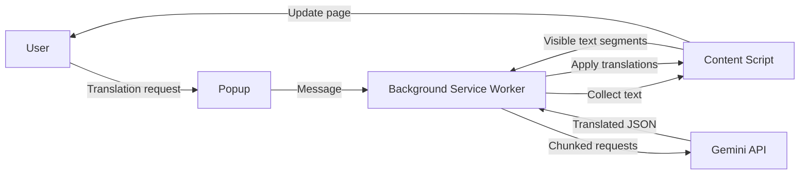

**Language:** English | [Korean](./README.ko.md)

# Context Translator

Context Translator is a Chrome extension that translates the current page with `gemini-3.1-flash-lite-preview`.

The project aims for a simple flow:

`open popup -> confirm settings -> translate`

## Quick Start

```text
1. Open chrome://extensions
2. Turn on "Developer mode"
3. Click "Load unpacked"
4. Select this project folder
5. Enter your Gemini API key in the popup and click "Save"
6. Click "Check" to verify the API connection
7. Open a page, choose the languages, and click "Translate"
```

The extension works on `http://` and `https://` pages only.

## Features

- Translate the current tab into the selected language
- Detect the source language automatically with `Auto`
- Swap source and target languages in one click
- Auto-translate selected languages or specific sites
- Show the original text on hover
- Display real-time translation progress
- Follow Chrome UI language for English/Korean popup text
- Save, clear, and verify the Gemini API key in the popup

## How It Works



### Runtime Flow

1. The popup loads the current tab and saved settings.
2. The background worker starts a translation run and tracks progress.
3. The content script collects visible text from the page.
4. The background worker splits the text into chunks and calls Gemini.
5. The content script applies the translated text back to the page.

## Auto-Translate Safety

Auto-translate is intentionally blocked on pages that may contain sensitive content, including:

- Mail services
- Collaboration and messaging tools
- Some Google Docs, Drive, and Calendar pages
- Pages with password fields

## Project Structure

```text
context-translator/
├─ manifest.json
├─ popup.html
├─ README.md
├─ README.ko.md
├─ _locales/
│  ├─ en/messages.json
│  └─ ko/messages.json
├─ docs/
└─ src/
   ├─ background/background.js
   ├─ content/content.css
   ├─ content/content.js
   ├─ popup/popup.css
   ├─ popup/popup.js
   └─ shared/i18n.js
```

## Validation

Use these commands after changing logic, popup markup, or locale/document files:

```text
node --check src/background/background.js
node --check src/content/content.js
node --check src/popup/popup.js
node scripts/validate-locales.mjs
```

## Limitations

- The extension only runs on `http://` and `https://` pages.
- Dynamic pages may change while a translation is running.
- The Gemini API key is stored locally in `chrome.storage.local`.
- Translation quality is best-effort and depends on page structure.

## License

This project is licensed under the [MIT License](./LICENSE).
